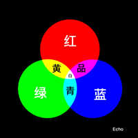
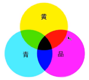
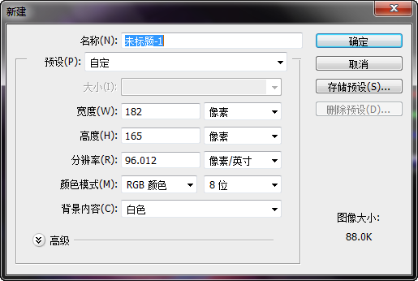
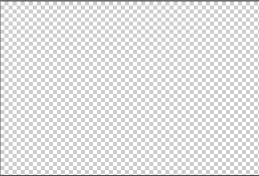

## 一、打开图片

- 找到菜单栏，点击“文件”，在下拉列表中选择“打开”，浏览到要打开的图片即可打开
- 或者左键双击界面上空白的区域，即可打开资源浏览器，浏览要打开的图片
- 可以通过截图的功能，将想要的图片截取下来，然后在菜单栏上的“文件”菜单中的下拉列表中找到“新建”，将“预设”设置为“剪贴板”，按Ctrl+v即可将截的图片打开

## 二、点阵图和矢量图

- 点阵图
    - 最小组成单位为像素，可操作的对象是每一个像素
    - 放大会失真
    - jpg，gif，psd都是点阵图
- 矢量图
    - 由一个一个的对象组成
    - 对象的定义通过数学函数来完成
    - 放大不会失真
    - 保存的是形状而不是像素

## 三、光与色的基础知识

- 光
    - 不能分解的光叫单色光
    - 由单色光混合而成的光叫复色光
    - 光的原色
        - 红（RED）
        - 绿（Green）
        - 蓝（Blue）
    - 由光的三原色可以复合出其他颜色的光（图1）
        - 等量的红光与绿光可以合成黄光
        - 等量的红光与蓝光可以合成品红色的光
        - 等量的绿光与蓝光可以合成青色光
        - 等量的红光，绿光还有蓝光可以合成白光
        - 什么光都没有则显示的是黑色的
    - 光源
        - 可以自己发光的物体
        - 本身光所带的颜色成为光源色
    - 固有色
        - 物体本身所具有的颜色
        - 反射与固有色相同的光
    - 光，色转换
        - 我们看到的物体的颜色不一定就是物体本身的固有色
        - 我们所看到的物体的颜色由光源和物体的固有色决定的
        - 物体在反射自己的固有色的光的同时也会反射少量的其他的光，特别是跟固有色相近的光
    - 混合的光的颜色越多，颜色越亮 
- 颜料
    - 三原色
        - 品红
        - 黄
    - 三原色的混合（图二）
        - 黄+品=红色
        - 黄+青=绿
        - 品+青=蓝
        - 黄+品+蓝=黑
    - 混合的颜料越多，反射的光越少，颜色越暗
- 光的三原色与颜料的三原色之间的区别
    - 光的三原色做的是加法，混合的光越多，光的颜色越亮
    - 颜料的三原色做的是减法，混合的颜料越多，所能反射的光就越少，颜色就越暗

  
图1 光的合成

  
图2 颜料的三原色

## 四、photoshop中颜色的混合
- 由RGB值表示颜色
- 每种颜色的范围均为0-255

## 五、图片的创建
- 打开菜单栏上的“文件”，在下拉菜单中选择“新建”选项，会弹出以下的窗口

- 名称：表示给图片的命名
- 预设：选择默认的设定，当选择完之后，下面的宽度，高度等值都会设置为默认值
- 宽度：指定图片的宽度，可以选择单位，常见以像素为单位
- 高度：指定图片的高度，可以选择单位，常见以像素为单位
- 分辨率：每一平方厘米或者平方英寸中包含像素点的多少，每一单位中包含的像素越多，图片就精细
- 颜色的模式：默认选择RGB颜色，后面的数字表示的是表示颜色所用的位数（8位，16位，32位），位数越多，所能表示的颜色越多
- 背景内容：

上图是Photoshop的拾色器，点击黑色部分可以设置前景颜色，点击红色部分可以设置背景颜色
背景内容中有三个选项
    - 白色：表示将背景设置为白色
    - 背景颜色：将背景设置为拾色器中选取的背景颜色，例如，根据上图设置的背景将是红色的
    - 透明：将背景设置为透明的，ps中表示用白灰相间的点格表示透明的背景，如下图表示的就是透明的背景

## 六、图片的保存
- 打开的图片若不进行任何的编辑，那么是不可以保存的
- 当我们对图片编辑好之后，可以点击菜单栏中的“文件”选项，在下拉列表中选择“存储为”或“存储为web格式”即可进行相应的保存
- jpg（jpeg），png，gif，psd图片格式与区别
    - jpg是网络中常见的图片格式，是照片的常用存储格式，不知支持透明，使用有损压缩，不能保存图层
    - png支持全透明，支持的颜色十分丰富，使用无损压缩
    - gif支持半透明，支持动画效果，支持的颜色单调，使用无损压缩
	- psd是四种格式中唯一支持保存图层的格式，但文件比较大

