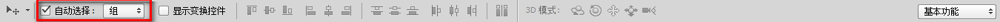

## 一、打开图片

- 找到菜单栏，点击“文件”，在下拉列表中选择“打开”，浏览到要打开的图片即可打开
- 或者左键双击界面上空白的区域，即可打开资源浏览器，浏览要打开的图片
- 可以通过截图的功能，将想要的图片截取下来，然后在菜单栏上的“文件”菜单中的下拉列表中找到“新建”，将“预设”设置为“剪贴板”，按Ctrl+v即可将截的图片打开

## 二、点阵图和矢量图

- 点阵图
    - 最小组成单位为像素，可操作的对象是每一个像素
    - 放大会失真
    - jpg，gif，psd都是点阵图
- 矢量图
    - 由一个一个的对象组成
    - 对象的定义通过数学函数来完成
    - 放大不会失真
    - 保存的是形状而不是像素

## 三、光与色的基础知识

- 光
    - 不能分解的光叫单色光
    - 由单色光混合而成的光叫复色光
    - 光的原色
        - 红（RED）
        - 绿（Green）
        - 蓝（Blue）
    - 由光的三原色可以复合出其他颜色的光（图1）
        - 等量的红光与绿光可以合成黄光
        - 等量的红光与蓝光可以合成品红色的光
        - 等量的绿光与蓝光可以合成青色光
        - 等量的红光，绿光还有蓝光可以合成白光
        - 什么光都没有则显示的是黑色的
    - 光源
        - 可以自己发光的物体
        - 本身光所带的颜色成为光源色
    - 固有色
        - 物体本身所具有的颜色
        - 反射与固有色相同的光
    - 光，色转换
        - 我们看到的物体的颜色不一定就是物体本身的固有色
        - 我们所看到的物体的颜色由光源和物体的固有色决定的
        - 物体在反射自己的固有色的光的同时也会反射少量的其他的光，特别是跟固有色相近的光
    - 混合的光的颜色越多，颜色越亮 
- 颜料
    - 三原色
        - 品红
        - 黄
    - 三原色的混合（图二）
        - 黄+品=红色
        - 黄+青=绿
        - 品+青=蓝
        - 黄+品+蓝=黑
    - 混合的颜料越多，反射的光越少，颜色越暗
- 光的三原色与颜料的三原色之间的区别
    - 光的三原色做的是加法，混合的光越多，光的颜色越亮
    - 颜料的三原色做的是减法，混合的颜料越多，所能反射的光就越少，颜色就越暗  

    
图1 光的合成  

    
图2 颜料的三原色

## 四、photoshop中颜色的混合
- 由RGB值表示颜色
- 每种颜色的范围均为0-255

## 五、图片的创建
- 打开菜单栏上的“文件”，在下拉菜单中选择“新建”选项，会弹出以下的窗口  
  
- 名称：表示给图片的命名
- 预设：选择默认的设定，当选择完之后，下面的宽度，高度等值都会设置为默认值
- 宽度：指定图片的宽度，可以选择单位，常见以像素为单位
- 高度：指定图片的高度，可以选择单位，常见以像素为单位
- 分辨率：每一平方厘米或者平方英寸中包含像素点的多少，每一单位中包含的像素越多，图片就精细
- 颜色的模式：默认选择RGB颜色，后面的数字表示的是表示颜色所用的位数（8位，16位，32位），位数越多，所能表示的颜色越多
- 背景内容：  
  
上图是Photoshop的拾色器，点击黑色部分可以设置前景颜色，点击红色部分可以设置背景颜色
背景内容中有三个选项
    - 白色：表示将背景设置为白色
    - 背景颜色：将背景设置为拾色器中选取的背景颜色，例如，根据上图设置的背景将是红色的
    - 透明：将背景设置为透明的，ps中表示用白灰相间的点格表示透明的背景，如下图表示的就是透明的背景  
  

## 六、图片的保存
- 打开的图片若不进行任何的编辑，那么是不可以保存的
- 当我们对图片编辑好之后，可以点击菜单栏中的“文件”选项，在下拉列表中选择“存储为”或“存储为web格式”即可进行相应的保存
- jpg（jpeg），png，gif，psd图片格式与区别
    - jpg是网络中常见的图片格式，是照片的常用存储格式，不知支持透明，使用有损压缩，不能保存图层
    - png支持全透明，支持的颜色十分丰富，使用无损压缩
    - gif支持半透明，支持动画效果，支持的颜色单调，使用无损压缩
	- psd是四种格式中唯一支持保存图层的格式，但文件比较大

## 七、界面组织
- 通过调整界面的颜色可有利于观察不同的图片时，有不同的对比
- 可以按Ctrl + F2调整界面，使其颜色变浅，成浅灰色
- 可以按ctrl + F1调整界面，使其颜色加深变黑 
初始界面显示的效果  
  
按Ctrl + F2后的显示效果  
  
按Ctrl + F1后的显示效果  
  
- 也可以通过右键画布，选择不同的颜色  
- 在ps最左边的工具栏的最下面可以找到如下的图标，右击图标可以选择屏幕模式，如可以设置全屏显示，按F键或ESC键退出全屏，按Tab键显示面板

## 八、移动工具的使用
- 在工具栏中可以找到图标，它表示的是选择工具
- 打开图片时，若图层面板中显示如下，即显示一个名为“背景”的图层，在其最右边有一个锁的标志，则不能直接使用选择工具移动图片，否则会提示错误信息  
  
- 要移动图片必须将锁移除，如下图所示，将锁标志沿着箭头移动到下面的垃圾桶中，即可移除锁  
  
此时就可以移动图片了，如下图所示  
  
- 如果我们点击工具栏上的“矩形选框工具”(显示图标为)，在只有单一图层的图片选择一定的区域后（虚线框中的区域被选中），然后用选择工具移动，会出现以下的效果  
  
此时我们按快捷键Ctrl+D（取消选择），被选中的区域不再被选中，它会覆盖原先的区域，此时我们移动图片的时候将移动整个图片，如下图所示(此时假如我们想把复原图片的话，选中之前被选中的区域，但当我们移动的时候会发现，连原先被覆盖的区域也跟着移动....)：  
  
其实最好的操作方法就是按Ctrl+J将被选中的区域复制到新的图层，这是我们移动被选中的区域的图层不会对原先的图片造成任何的影响  
下面我将以下的图片进行操作    
    
注意到，这个图片有五个图层（每一只蝴蝶占据一个图层，共四个图层，还有一个背景层），在图层面板中可以看出，还有此时此时选中的是名为"豹斑蝶"的图层  
- 在工具栏中选中“移动工具”，在图片上上进行拖动，我们会发现，虽然图片有多个图层，但是我们能拖动的只是当前选中的图层，即“豹斑蝶”图层，若选中其他的图层在进行操作也是如此（选中图层的方式是在“图层”面板中点击要操作的图层）
- 怎么实现自动选择图层呢（在该图中，我们要做的是鼠标选择到哪个图层，就对哪个图层进行操作）：在菜单栏下面找到“自动选择”（看下图），进行勾选，现在我们进行操作，可以发现我们点击哪个蝴蝶，就会对选中该蝴蝶所在的图层（在图层面板中也可以看出选中了哪个图层）    
    
- 若我们固定背景图（如下如所示，在背景图上有一“小锁”的标志，可以通过选中背景图层，然后点击上面的“小锁”实现加锁操作）：    
    
此时我们使用选择工具，将出现虚线框，此时我们可以选中多个图层，如下图中，我们选中了四个图层      
    

## 九、初识选择区
- 关于选择区工具，我们在知识点八中其实已经看到，在工具栏中找到
- 选择区的作用其实是选择我们编辑的区域范围，对选择区的编辑不会影响选择区之外的区域
原先的图片是这样的  
  
选择区域并修改显示颜色，修改后的图片显示如下：  
  
在编辑的时候我们会发现我们只能对被选中的区域进行编辑，而不能对选中的区域外进行编辑
